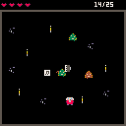
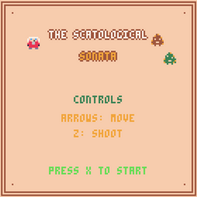
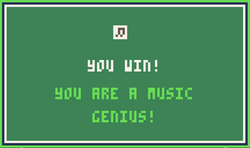
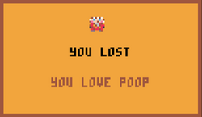

# The Scatological Sonata

> A chaotic one-screen arcade survival game where you play Wolfgang Amadeus Mozart and fight off a filthy musical catastrophe.

Made in **PICO-8**. Solo project — code, pixel art, and original chiptune music.

**▶ [Play it in your browser on itch.io](https://buentipojorge.itch.io/the-scatological-sonata)**



---

## About

The Scatological Sonata is a top-down arcade shoot 'em up built in PICO-8, inspired by *Journey of the Prairie King* — the arcade minigame inside *Stardew Valley*. You control Mozart, trapped in a candlelit hall, and survive waves of living poop by firing musical notes at them. The design goal: **chaotic fun under pressure** — on the edge of collapse, but laughing.

It was built for **Seminario de Práctica Profesional** at Universidad Siglo 21 (first semester 2026), where it was graded **10/10** and selected for the faculty's "Best Projects of the Year" showcase.

This build is a **vertical-slice prototype**. The scope was deliberately cut from the full three-level concept down to a single arena, to validate the core mechanic, controls, and game feel in the browser before building outward.

## How to play

| Input | Action |
| --- | --- |
| Arrow keys | Move |
| **Z** (hold) | Stop and shoot in the direction you press |
| **X** | Start / pause / resume / confirm |

Clear **25 enemies** to win. You start with 3 lives (5 max) and get a brief moment of invulnerability after each hit. Enemies spawn from the edges and home in on you; two types, increasing pressure as the screen fills.

**Drops** from defeated enemies:

- **Rapid fire** — a few seconds of greatly increased fire rate
- **Extra life**

> **Design note:** in this prototype, shooting freezes your position and the arrow keys become your aim. The intended scheme — free movement with independent twin-stick aim — is planned for later development. The reasoning is written up in the concept document.

## Built with

- **[PICO-8](https://www.lexaloffle.com/pico-8.php)** — fantasy console, 128×128 resolution, fixed 16-colour palette. The constraints *are* the art direction.
- **Lua** — game code
- **PICO-8** sprite editor (pixel art) and tracker (music + sound effects)

Everything in the cartridge was made by me: code, art, music, and sound.

## Repository contents

```
scatological_sonata.p8   the PICO-8 cartridge — open it in PICO-8, or drag it in and `run`
Screenshots/             title, gameplay, win and lose screens
docs/                    concept document and pitch deck (PDF)
builds/                  desktop builds — Windows / macOS / Linux / Raspberry Pi (.zip)
gameplay.mov             gameplay recording
```

The browser build lives on [itch.io](https://buentipojorge.itch.io/the-scatological-sonata) — that's the easiest way to try it.

## Screenshots

| Menu | Win | Lose |
| --- | --- | --- |
|  |  |  |

## Credits

**Marco Petruccelli** — design, programming, pixel art, music.
Inspired by *Journey of the Prairie King* by ConcernedApe.

## License

The source code in this repository is released under the [MIT License](LICENSE).
